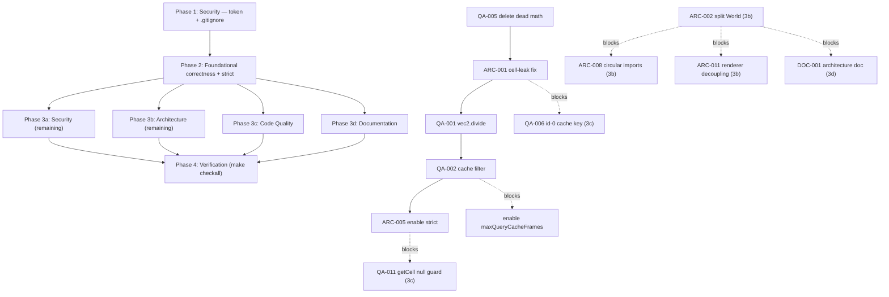

# Project Audit Report

> **Project**: `par-zombie3` (repo dir `zombies-v3`)
> **Date**: 2026-07-21
> **Stack**: TypeScript 7 (native) · WebGL2 (twgl.js) · webpack 5 + esbuild-loader · chroma-js · fast-simplex-noise · underscore
> **Size**: ~5,659 lines of TS across ~40 files in `src/`
> **Audited by**: Claude Code Audit System (four specialist agents: Architecture, Security, Code Quality, Documentation)

---

## Executive Summary

`par-zombie3` is a real-time WebGL2 boid/flocking simulation (zombies chase humans, food spawns, GPU-instanced rendering) with genuinely sound bones: a clean entity/behaviour/grid/math/shader layering, a well-applied Strategy pattern for behaviours, and a spatial-hash grid for O(1) neighbour queries. The high-level architecture is the project's strongest asset.

The bones are undermined by **silent correctness bugs**, a **718-line God object**, and the **complete absence of tests, lint, formatting, and a Makefile**. Three correctness bugs were verified directly against source during synthesis and are the headline findings: every boid silently lives in **two grid cells permanently** after its first move (doubling all steering forces), `vec2.divide()` ignores its `dest` argument, and a `HashGrid` cache `.filter()` result is discarded. Compounding this, **~2,300 lines (40%) of the custom math library are dead code** (the game uses twgl's `m4`), and **`tsconfig.json` does not enable `strict`**, so null/undefined bugs the compiler should catch instead surface at runtime.

The single most time-sensitive finding is **not a code bug**: a **live API token sits in `.claude/settings.local.json`** — untracked and never committed, but one `git add .claude/` away from leaking into a public GitHub-Pages-served repo, and `.gitignore` does not exclude `.claude/`. Estimated effort to remediate the top issues is **1–2 focused days** (token + correctness Criticals + strict mode + dead-code purge + test scaffolding).

**Positive strength to lead with:** the codebase has **zero security vulnerabilities** (`yarn audit` = 0 across 435 deps), zero XSS sinks, zero network surface, zero client-side storage, and compiles 100% clean under TypeScript 7. The security posture is strong for a client-only game.

### Issue Count by Severity

| Severity | Architecture | Security | Code Quality | Documentation | Total |
|----------|:-----------:|:--------:|:------------:|:-------------:|:-----:|
| 🔴 Critical | 1 | 0 | 5 | 2 | **8** |
| 🟠 High     | 4 | 0 | 8 | 5 | **17** |
| 🟡 Medium   | 10 | 2 | 14 | 5 | **31** |
| 🔵 Low      | 10 | 4 | 11 | 4 | **29** |
| **Total**   | **25** | **6** | **38** | **16** | **85** |

> Counts are as-reported by each specialist agent. Several findings are **independently corroborated by multiple agents** (e.g. WebGL context-loss, the no-op resize listener, the id-0 cache collision, missing Makefile/lint, `console.log` noise) — those carry the highest confidence and are noted in the Detailed Findings. Three correctness Criticals were **verified directly against source** during synthesis (marked ✅ VERIFIED below).

---

## 🔴 Critical Issues (Resolve Immediately)

### [ARC-001] Boid cell re-indexing leaks every boid into two cells permanently ✅ VERIFIED
- **Area**: Architecture / Data-structure correctness
- **Location**: `src/boids/Boid.ts:154-156` (tick), `src/grids/HashGrid.ts:304-318` (`addCelDataByIndex`), `src/boids/Boid.ts:100-105` (`die`)
- **Description**: `Boid.tick` removes the boid via `grid.removeCelDataByIndex(this.lastCellIndex, this)` before re-adding it to the new cell. But `addCelDataByIndex` (`HashGrid.ts:312`) does `v.lastCellIndex = v.cellIndex` *before* `v.cellIndex = cellIndex`, so `lastCellIndex` always lags one move behind the cell the boid actually occupies. Traced and confirmed:
  - Move 1: removes from A ✓, adds to B → `lastCellIndex=A, cellIndex=B`.
  - Move 2: tries to remove from `lastCellIndex=A`, but the boid is in B → `indexOf` returns -1, removal silently returns `false` (`HashGrid.ts:335-338`), boid stays in B; adds to C → boid now in **both B and C**.
- **Impact**: From the second move onward every boid exists in two cells. `getDataRadius` neighbour queries return every boid **twice**, doubling all steering/collision/align/separate forces (the simulation is wrong, not merely imprecise). `BoidGrid.draw` density colouring is permanently inflated/flickering. `die()` only removes from `cellIndex`, so the stale `lastCellIndex` phantom is never reclaimed → slow memory growth and phantom-neighbour force on survivors.
- **Remedy**: Remove from the cell the boid actually lives in — `grid.removeCelDataByIndex(this.cellIndex, this)` *before* `addCelDataByIndex` updates the index. Reconsider the `lastCellIndex` field's meaning (it is only meaningful inside `addCelDataByIndex` and should not be re-read by callers). Add a debug assertion that unique boids across all cells equals `allData.size` for one frame.

### [QA-001] `vec2.divide()` ignores `dest` and silently mutates `this` ✅ VERIFIED
- **Area**: Code Quality / Math-library correctness
- **Location**: `src/math/vec2.ts:199-207`
- **Description**: The convention for `add`/`subtract`/`multiply`/`scale` (e.g. `vec2.ts:173`) is "write to `dest` if provided, else mutate `this`." `divide` (`vec2.ts:203-204`) instead does `this.x /= vector.x; this.y /= vector.y;` and returns `dest` without ever writing to it. Any caller passing a `dest` for non-destructive division gets a mutated `this` and an unchanged `dest`.
- **Impact**: Silent wrong results for any non-destructive division call. (vec3/vec4 `divide` carry the same pattern but those files are dead code — see QA-005.)
- **Remedy**: `dest.x = this.x / vector.x; dest.y = this.y / vector.y;` mirroring the other arithmetic methods.

### [QA-002] `HashGrid.getDataRadius` cache `.filter()` result is discarded ✅ VERIFIED
- **Area**: Code Quality / Grid correctness
- **Location**: `src/grids/HashGrid.ts:187-189`
- **Description**: `if (radius < getDataRadiusCacheResult.radius) { getDataRadiusCacheResult.data.filter(i => i.dist2 <= radius2); }` — `Array.filter` returns a new array; the result is not assigned. The narrowed-radius path then returns the **unfiltered** cached data (`HashGrid.ts:190`).
- **Impact**: Behaviours querying with a smaller radius than a cached query (e.g. `ConvertHumanBehavior`, `AlignBehavior`, `CollisionBehavior`) receive neighbours outside the requested radius → far-away "conversions" and collision jumps. Currently **dormant** because `maxQueryCacheFrames: 0` (`World.ts:442,451`); becomes live the moment the cache is enabled.
- **Remedy**: Reassign (`getDataRadiusCacheResult.data = … .filter(…)`) or re-query. Pair with the id-0 cache-key fix (QA-006).

### [QA-003] Shared mutable static "constants" in the math library
- **Area**: Code Quality / Shared-state correctness
- **Location**: `src/math/vec2.ts:86-91` (`zero`/`one`/`up`/`down`/`left`/`right`), `mat4.ts:16`, `mat3.ts:17`, `vec3.ts:92-102`, `quat.ts:62`; also `mat4.lookAt` returns the shared `identity` (`mat4.ts:533`)
- **Description**: `static readonly identity = new mat4().setIdentity()` is `readonly` only at the reference — the underlying `Float32Array` is fully mutable. `vec2.up`/`vec2.zero` (used throughout live code) have the same hazard.
- **Impact**: One stray `.setIdentity()` on `mat4.identity`, or a `m.copy()` that forgets its arg, corrupts every consumer. Currently low blast radius because most affected files are dead code (QA-005), but `vec2` statics are live.
- **Remedy**: `Object.freeze` the instances and their fields, or expose them as factory functions (`static zero(): vec2 { return new vec2(0,0); }`). After QA-005 deletes the dead files this only needs fixing in `vec2.ts`.

### [QA-004] No tests at all — custom math + spatial hash entirely unverified
- **Area**: Code Quality / Test coverage
- **Location**: `package.json:15` (`"test": "echo 'Error: no test specified' && exit 1"`)
- **Description**: This is a hand-rolled `vec2`/`HashGrid`/behaviour library — precisely where a one-line `divide()` bug or a discarded `.filter()` survives for months. Zero test files, no test runner, no Makefile (`make checkall` cannot exist).
- **Impact**: Every bug in this audit (and every future refactor) has nothing to catch it. QA-001/QA-002/ARC-001 are the canonical examples a 30-second unit test would have caught.
- **Remedy**: Add Vitest (native ESM, webpack-friendly). Seed with property/randomized tests for `vec2` (idempotent normalize, inverse of multiply, length invariants) and integration tests for `HashGrid.getDataRadius` (cache invariants, layer masking, closest-only, wrap mode, cell-index edges) and `Boid.tick` cell tracking.

### [QA-005] ~2,276 lines of the local math library are dead code
- **Area**: Code Quality / Dead code
- **Location**: `src/math/mat4.ts` (648), `mat3.ts` (487), `quat.ts` (507), `vec3.ts` (422), `mat2.ts` (212); also `map` in `scalar.ts`
- **Description**: Symbol usage outside `src/math/`: `vec3` 0, `mat2` 0, `mat3` 0, `mat4` 1 (the single hit is the GLSL `uniform mat4 u_matrix;`, not TS), `quat` 0. The game uses twgl.js's `m4` for orthographic projection (`World.ts:3,120,648,653`).
- **Impact**: ~40% of the codebase is dead weight that compiles, type-checks, and ships in the bundle. It taxes every reader and CI minute, hides bugs (QA-001/QA-003 live in these files), and is a trip-wire (anyone reading `mat4.ts` reasonably assumes it is load-bearing).
- **Remedy**: Delete `mat2.ts`, `mat3.ts`, `mat4.ts`, `vec3.ts`, `quat.ts`, and the `map` export from `scalar.ts`; remove them from `src/math/index.ts`. Restore from git history if ever needed.

### [DOC-001] No architecture/design documentation for a non-trivial simulation pipeline
- **Area**: Documentation / Architecture docs
- **Location**: Missing — no `docs/architecture/`, no `ARCHITECTURE.md`; `docs/` holds only `superpowers/specs/2026-07-21-typescript-7-toolchain-design.md`
- **Description**: The project has a rich pipeline — entity lifecycle → behaviour composition → spatial hashing → GPU-instanced rendering (3 shader programs) → paintable multi-layer flow field — and none of it is documented. The custom `src/math/` conventions (mutate-vs-dest, return-on-singular) and GLSL per-instance attribute packing (`pos_vel.xy` = pos, `.zw` = vel, `rad_static.x` = radius, `.y` = static flag) are nowhere explained.
- **Impact**: Any maintainer (or agent) must reverse-engineer the data flow, behaviour-priority system, `HashGrid` cache, and `World.init*Gl` buffer layouts from source. The highest-leverage onboarding gap.
- **Remedy**: Add `docs/architecture/system-overview.md` with a Mermaid component diagram (World → grids → boids → behaviours → render passes), a frame-loop sequence diagram, a `src/math` conventions page, and per-shader attribute-packing comments. Best written **after** ARC-002 (World split) so it documents the new structure.

### [DOC-002] `package.json` has empty `description` and invalid `keywords`
- **Area**: Documentation / Project metadata
- **Location**: `package.json:3-4` (`"description": ""`, `"keywords": ""`)
- **Description**: Both fields are empty; `keywords` is the wrong type (npm/JSON-Schema expect an array of strings). The README's opening description ("A real-time WebGL2 boid simulation…") is good but not reflected in package metadata.
- **Impact**: Empty GitHub "About", no npm/GitHub topic tags, no `yarn info`/search signal.
- **Remedy**: Set `description` to the README opener; set `keywords` to `["boids","flocking-simulation","webgl2","typescript","game","simulation","twgl","procedural"]`.

---

## 🟠 High Priority Issues

### [ARC-002] `World.ts` is a 718-line God object mixing six responsibilities
- **Area**: Architecture / SRP · Location: `src/World.ts`
- **Description**: `World` owns WebGL program/buffer setup, the render loop, DOM/canvas + mouse/keyboard input, the entity factory/spawner, procedural flow-field generation, the food-gradient solver, and HUD stats. Every cross-cutting concern funnels through it; nothing below `World` can be instantiated without a `World`.
- **Impact**: Untestable (no way to construct a `Boid`/`HashGrid` without a WebGL2 context + DOM), change-fragile, blocks parallel work, and forces circular imports (`World ↔ grids ↔ boids`).
- **Remedy**: Split along existing seams — `Renderer` (GL programs/buffers + draw), `Input`/`MouseController`, `BoidFactory`/`Spawner`, `FlowFieldGenerator`; keep `World` as a thin orchestrator owning the grids and tick loop. Inject collaborators rather than reaching through `world.X`.

### [ARC-003] No tests, no lint, no format, no Makefile (R11 violation)
- **Area**: Architecture / Build & tooling · Location: `package.json:6-16`; no `Makefile`
- **Description**: `scripts.test` is the echo-error placeholder; no ESLint/Prettier/Biome; no `lint`/`fmt`/`checkall` targets required by the project's mandatory tooling baseline; CI runs only `yarn build`.
- **Impact**: Latent bugs ship silently (ARC-001 is the canonical example). Style drift goes unchecked. Violates the mandatory Makefile baseline.
- **Remedy**: Add ESLint (`typescript-eslint`) + Prettier, a `Makefile` with `build/test/lint/fmt/typecheck/checkall` + `pre-commit`, Vitest (see QA-004), and update CI to run `make checkall`.

### [ARC-004] Unsafe cast and in-hot-loop allocation in `Human.tick`
- **Area**: Architecture / Type safety & perf · Location: `src/boids/Human.ts:89` (`as unknown as Food`), `src/boids/Human.ts:106` (per-frame `chroma` `.gl()`)
- **Description**: Line 89 double-casts a grid lookup that is typed `HashGrid<Boid>` to `Food`; a non-Food in the food layer (possible via ARC-001's leak) silently calls `Food` members on the wrong class. Line 106 re-runs a chroma scale + `.gl()` (new rgba array) every frame for every living human.
- **Impact**: Type hole the simulator can violate at runtime; ~4200 chroma evaluations/sec + array allocations on the render thread.
- **Remedy**: Type the food layer explicitly or guard with `instanceof Food`; precompute the hunger gradient as a fixed `vec4` LUT indexed by `Math.floor(hunger)`.

### [ARC-005] `tsconfig.json` is not in `strict` mode
- **Area**: Architecture / Type safety · Location: `tsconfig.json:2-23`
- **Description**: Enables `noImplicitAny`/`noUnusedLocals`/`noUnusedParameters`/`noImplicitReturns`/`noImplicitOverride` but omits `strict` (so `strictNullChecks`, `strictFunctionTypes`, `strictPropertyInitialization`, etc. are off). The code leans on `!` definite-assignment and non-null assertions (`World.ts:153` `getContext('webgl2')!`, `Boid.ts:159` `getCell(...)!`) that are unchecked lies without `strictPropertyInitialization`/`strictNullChecks`.
- **Impact**: Null/undefined bugs are invisible to the compiler and surface at runtime as opaque `TypeError`s.
- **Remedy**: Set `"strict": true` and resolve the resulting errors (mostly `if (!ctx) throw …` guards and explicit init). Single highest-leverage type-safety improvement. Found independently by both Architecture and Code Quality agents.

### [QA-006] `HashGrid.getDataRadius` cache key collides for id 0 (corroborated ARC)
- **Area**: Code Quality / Grid correctness · Location: `src/grids/HashGrid.ts:167,172`
- **Description**: `${(self?.id || 0)}` — a real boid/food with `id === 0` collides with queries that omit `self`. Found independently by Architecture (ARC-006) and Code Quality.
- **Impact**: Stale/wrong neighbour lists for id-0 entities when the cache is enabled. Dormant now (`maxQueryCacheFrames: 0`).
- **Remedy**: `self?.id ?? -1` (a sentinel that cannot be a real id).

### [QA-007] WebGL2 context loss is not handled (corroborated SEC-005, DOC-007)
- **Area**: Code Quality / Error handling · Location: `src/World.ts:151-265` (no `webglcontextlost`/`webglcontextrestored` listeners)
- **Description**: GPU buffers/programs/uniforms are set up once and assumed immortal. On power-saving switch, tab eviction, or driver reset the context is lost; with no handler the canvas silently freezes and subsequent GL calls throw/no-op. Found by three agents (Security, Code Quality, Documentation).
- **Impact**: Silent freeze on context loss (common on macOS when backgrounding a GPU-heavy tab). Availability/UX, not a confidentiality issue.
- **Remedy**: Add `webglcontextlost` (`e.preventDefault()`) + `webglcontextrestored` listeners that re-run the four `init*Gl` methods and re-upload buffers. Land together with the `dispose()`/`setInterval` cleanup (QA-013).

### [QA-008] Window-resize listener is a no-op curried function (corroborated ARC)
- **Area**: Code Quality / Correctness · Location: `src/World.ts:238-240`
- **Description**: `window.addEventListener('resize', () => () => { /* this.resize(); */ })` — the outer arrow **returns** an inner arrow that is never called. Even uncommented, the body never runs. Found independently by Architecture and Code Quality.
- **Impact**: Resizing the browser never calls `resize()`; canvas keeps initial dimensions, grid desyncs, mouse coordinates map to stale world coords.
- **Remedy**: `window.addEventListener('resize', () => { this.resize(); })` (debounce recommended).

### [QA-009] No WebGL2 capability fallback; non-null assertion at construction
- **Area**: Code Quality / Error handling · Location: `src/World.ts:153` — `this.ctx = this.canvas.getContext('webgl2')!;`
- **Description**: On browsers without WebGL2 this returns `null` and the `!` lies to the compiler; the next line throws `Cannot read properties of null`.
- **Impact**: Hard crash with no user-facing message on unsupported browsers.
- **Remedy**: Check for `null`, show a fallback message ("WebGL2 is required"), and exit.

### [QA-010] `numBoids / 4` is a float used as an integer partition threshold
- **Area**: Code Quality / Numeric correctness · Location: `src/World.ts:536`
- **Description**: `if (i < this.numBoids / 4)` is fine for `numBoids=100` (→25) but drifts for non-multiples-of-4 (e.g. 50 → 12.5).
- **Impact**: Wrong species ratios at common boid counts.
- **Remedy**: `Math.floor(this.numBoids / 4)`.

### [QA-011] Non-null assertion on `flowGrid.getCell` can crash at the world edge
- **Area**: Code Quality / TS anti-pattern · Location: `src/boids/Boid.ts:159`
- **Description**: `getCell` returns `Cell | undefined` outside the grid; the `!` suppresses the check. A boid clamped/teleported to exactly the world edge lands off-grid, then `cell.items[this.layer]` throws.
- **Impact**: Rare but real crash; would be caught immediately under `strictNullChecks`.
- **Remedy**: Guard explicitly and skip the flow update when no cell.

### [QA-012] Per-frame allocations across the simulation hot loop (corroborated ARC-007)
- **Area**: Code Quality / Performance · Location: `src/boids/Boid.ts:127,165`; `src/grids/HashGrid.ts:199,213`; `src/behaviours/{CollisionBehavior:44-47, SteerLayerBehavior:48, SeparateBehavior:34, FlowBehavior:39}.ts`; `src/boids/Human.ts:106`; `src/grids/BoidGrid.ts`
- **Description**: Each tick allocates multiple `vec2` temporaries (and a chroma instance per hungry human, per cell-coloured grid cell). The `vec2`/`vec4` API already supports `dest?` out-params for exactly this — inconsistently used.
- **Impact**: ~36k+ short-lived allocations/sec at 100 boids × 60 fps; GC jitter on lower-end hardware.
- **Remedy**: Allocate a per-`Boid` scratch `{ t, fp1, fp2, dTemp }` once and reuse via `dest`; cache `hungerGradient` in a LUT.

### [QA-013] `setInterval` timers never cleared (no `dispose()` / cleanup)
- **Area**: Code Quality / Lifecycle · Location: `src/GameClock.ts:36-43`, `src/World.ts:259-264`
- **Description**: The FPS-sampling and stats intervals run forever; under HMR they leak across reloads.
- **Impact**: Timer leaks; coupled with QA-007's context-restore work.
- **Remedy**: Track the ids, expose `dispose()`, clear on `beforeunload`.

### [DOC-003] Public API surface is entirely undocumented
- **Area**: Documentation / API · Location: `src/interfaces.ts:1-24`; `src/World.ts`, `src/boids/Boid.ts`, `src/grids/HashGrid.ts`, all `src/math/*.ts`, all `src/behaviours/*.ts` — zero JSDoc
- **Description**: 7 block comments across all of `src/` (all misformatted `/***` in `Cell.ts`, see DOC-012); ~133 single-line comments across ~5,659 LOC. Non-obvious APIs (`getDataRadius`'s 8-arg signature, `Boid.behaviors` run-order, `World.init*Gl` layouts) have no explanatory text.
- **Impact**: API misuse is likely; the `dest?` mutate-or-return pattern and behaviour-priority system are unexplained.
- **Remedy**: Module docstrings per file; JSDoc on exported classes and the genuinely non-obvious methods. Run **after** DOC-001.

### [DOC-004] No `CONTRIBUTING.md` and no contributor/CI guide
- **Area**: Documentation / Development · Location: Missing
- **Description**: No contributor guide for branch/PR workflow, Conventional-Commits convention (recent history uses `fix(render):`, `docs(ci):`), lint/format expectations, or how to add a behaviour/boid type/shader.
- **Impact**: New contributors must infer conventions from the commit log and `BoidBehavior.ts`.
- **Remedy**: Add `CONTRIBUTING.md`. Run after DOC-001.

### [DOC-005] No `CHANGELOG.md`, version frozen at `0.0.1`
- **Area**: Documentation / Versioning · Location: Missing; `package.json:2`
- **Description**: Despite substantial shipped work (TS 7 migration, security sweep to 0, render fixes, Pages deploy), there is no changelog and the version has never moved.
- **Impact**: No signal of what changed when; `zombies-v3` raises the question of where v1/v2 are.
- **Remedy**: Add `CHANGELOG.md` (Keep-a-Changelog); backfill recent entries from git history; document versioning policy.

### [DOC-006] README license attribution conflicts with `LICENSE.txt`
- **Area**: Documentation / License · Location: `README.md:80` ("MIT © Paul Robello") vs `LICENSE.txt:1` ("Copyright (c) HTML5 Boilerplate")
- **Description**: README + `package.json` attribute MIT to Paul Robello; `LICENSE.txt` still carries the HTML5 Boilerplate copyright from the scaffold origin.
- **Impact**: Factually wrong attribution that downstream copyists may perpetuate.
- **Remedy**: Update `LICENSE.txt:1` to `Copyright (c) Paul Robello` (add a second line for HTML5 Boilerplate only if any of its code genuinely remains). **Flag for explicit user confirmation — it's a legal/attribution edit.**

### [DOC-007] No troubleshooting/operational runbook; context-loss undocumented
- **Area**: Documentation / Operations · Location: Missing; no `webglcontextlost` handling (see QA-007)
- **Description**: No guidance for black canvas / context loss, shader-compile failures, blank page after `yarn start` (likely WebGL2 unsupported), or browser-support floor. The two recent `fix(render): boid heading stripe` commits encode a constraint not yet captured as an in-shader comment.
- **Remedy**: Add `docs/troubleshooting/common-issues.md`; add a comment in `src/shaders/boid.fs:20-25` explaining the leading-half heading-stripe rule.

---

## 🟡 Medium Priority Issues

### Architecture
- **[ARC-006]** Sparse-array abuse — layer bitmask IDs (`layerByName` returns 2/4/8/16/32) are also used as direct indices into `cell.items[]`; `FlowGrid.resize` hard-codes `cell.items.length = 256`; the same `Cell.items` field means two incompatible things across grids. Adding a 9th layer silently overflows. `src/World.ts:283-289`, `src/grids/FlowGrid.ts:50`. *Blocks any new-layer gameplay feature.*
- **[ARC-007a]** `HashGrid.numNeighbors` unit-confusion in the non-`worldSpace` branch — compares a world-space distance against `computeNeighborRadius` (cell-count units), always clamping; masked today by external `Math.min(9, …)`. `src/grids/HashGrid.ts:141-157`.
- **[ARC-007b]** `webpack --config-node-env` is not a real webpack-cli flag (it's `--node-env`); dev/prod scripts don't actually set `NODE_ENV`. `package.json:10,12-14`. (Corroborates SEC-003/DOC-010 as a single build-config work item.)
- **[ARC-007c]** `webpack.config.js` ships inline source maps unconditionally → inflated production bundle. `webpack.config.js:6`. (Corroborates SEC-003.)
- **[ARC-008]** Circular imports `World ↔ grids ↔ boids` — blocks headless instantiation/tree-shaking; fragile load order. `src/grids/HashGrid.ts:5`, `src/grids/FlowGrid.ts:6`, `src/boids/Boid.ts:12`, `src/Ring.ts:4`. *Depends on ARC-002.*
- **[ARC-009]** Module-level mutable singleton `let id = 0` for boid IDs, used directly as a GPU buffer offset — a second `World`/HMR reuses the counter and overflows per-world buffers. `src/boids/Boid.ts:30`. (Corroborates QA module-level-id finding.)
- **[ARC-010]** `BoidBehavior.tick`/`IProgressible.tick` boolean return values are universally ignored — the contract is decorative. `src/interfaces.ts:13-15`.
- **[ARC-011]** `Boid.draw` reaches into world GL buffers, coupling simulation to WebGL; the `IDrawable.draw(ctx)` interface is renderer-agnostic in name only. `src/boids/Boid.ts:194-211`. *Depends on ARC-002.*
- **[ARC-012]** `getDataRadius` cache key collision for id 0 — see QA-006 (canonical).
- **[ARC-013]** Dead window-resize handler — see QA-008 (canonical).
- **[ARC-014]** Per-frame allocations — see QA-012 (canonical).

### Security
- **[SEC-001]** ✅ **RESOLVED (by user context, 2026-07-21).** The live API token in `.claude/settings.local.json` is **per-project by design** and has **never been synced** off this machine, so no rotation is required and the "move to user-global" remedy does not apply. The only real risk it carried — an accidental `git add .claude/` committing it to the public repo — is closed by SEC-002 below. No further token action warranted.
- **[SEC-002]** ✅ **FIXED** (commit `e1c844e`, 2026-07-21). `.gitignore` now excludes `.claude/`, `.env*`, `*.pem`, `*.key`, `*.local` (with `!.env.example` negation). Verified via `git check-ignore`: `.claude/settings.local.json` and `.env` are matched; `.env.example` still allowed.

### Code Quality
- **[QA-014]** `console.log`/`warn` shipped in production (12 live: `World.ts` ×10, `FlowGrid.ts` ×1, `HashGrid.ts` ×2). Every keypress/click/init prints. (Corroborates DOC-013, ARC Low.)
- **[QA-015]** ~133 lines of commented-out dead code across `src/`. Delete; use git history.
- **[QA-016]** `options.x || default` falsy-coalescing bug pattern — `||` triggers on legitimate `0` (`maxSpeed: 0` for Food, `id: 0`). Use `??`. `src/boids/Boid.ts:65-77`; `quat.ts:56-59`.
- **[QA-017]** `FlowGrid` `cell.items.length = 256` magic size — pre-allocates 252 empty slots/cell; silently resizes past layer 256. `src/grids/FlowGrid.ts:50`. (Same root as ARC-006.)
- **[QA-018]** `getDataRadius` cyclomatic complexity ~12 over 88 lines with overlapping params — split into `getCached`/`queryNeighbors`/`findClosest`/`findAll`; numeric hash keys. `src/grids/HashGrid.ts:159-247`.
- **[QA-019]** Variable shadowing in `FlowBehavior` — outer `d: IFlowValue` vs inner `d: vec2`. `src/behaviours/FlowBehavior.ts:30,38`.
- **[QA-020]** GLSL `boid.vs:28` divide-by-zero for stationary boids (`pos_vel.zw / l` where `l` can be 0 → NaN); `grid.vs:59-60` `length()` of a scalar (likely meant `length(vel_len.xy)`) and `normalize()` of zero. `src/shaders/boid.vs:28`, `grid.vs:59-60`.
- **[QA-021]** `ConvertHumanBehavior.tick` queries a cached grid while mutating results — a second zombie in the cell tries to kill already-dead humans when the cache is enabled. `src/behaviours/ConvertHumanBehavior.ts:33-37`. Dormant now.
- **[QA-022]** `computeFoodGradient` iterates the entire flow grid on every food state change → O(foods × cells)/frame. Mark dirty, recompute once. `src/boids/Food.ts:27,30,39`.
- **[QA-023]** `genField` re-randomizes `fieldRandomScale` on every resize → the flow field "jumps" on window resize. `src/World.ts:472`.
- **[QA-024]** `Food.tick` uses `this.r +=` (side effect) inside `Math.min(…)`. `src/boids/Food.ts:24`.
- **[QA-025]** Inconsistent directory naming (`behaviours/` British vs `neighbors`/`color` American) — pick one, rename to `behaviors/`.
- **[QA-026]** `Food.die` writes `this.World.boids[boid.id] = boid` — works only because ids are dense from 0. `src/boids/Human.ts`.
- **[QA-027]** Magic numbers throughout behaviours/grids/shaders (~76 literals) — extract per-file `TUNING` objects.

### Documentation
- **[DOC-008]** No screenshots/GIF in README (a simulation's strongest onboarding signal). `README.md`.
- **[DOC-009]** README omits `yarn watch` and doesn't explain the placeholder `yarn test` error. `README.md:61-67`.
- **[DOC-010]** Vague Node version ("LTS"); `--config-node-env` flag undocumented/likely typo. `README.md:49-59`, `.github/workflows/deploy.yml:25`. (Corroborates ARC-007b.)
- **[DOC-011]** No `Makefile` with standard targets (corroborates ARC-003/QA).
- **[DOC-012]** `Cell.ts` JSDoc opens with `/***` (block comment) instead of `/**` (JSDoc) — tooling ignores the only documented file. `src/grids/Cell.ts:11,15,21,26,30,34,43`.

---

## 🔵 Low Priority / Improvements

### Architecture / Code Quality (consolidated)
- Stray `// debugger;` comments in `HashGrid.ts:306`, `FlowGrid.ts:56` — delete.
- `Math.random()` everywhere with no seed — add a seeded PRNG (`mulberry32`/`alea`) for reproducible bugs and stable screenshots (per agent-operability guidance).
- No agent-operability hooks (`--screenshot`, `--exit-after`, `--dump-state`, fixed canvas, seed flag) — cheap to add for a real-time canvas app.
- GitHub Actions pinned to floating major tags, not SHAs (corroborates SEC-004). `.github/workflows/deploy.yml`.
- `package.json` `resolutions` block pins `ajv`/`picomatch` (load-bearing per commit `fe8a68d`) — add a comment so the next upgrade doesn't sweep them away.
- `Boid` exposes `this.grid`, `this.options.grid`, and `this.Grid` — three ways to access the same thing; pick one.
- `BoidBehavior.name` is a mutable public field — make `readonly`/static.
- `IAttractionPointBehaviorOptions` default exports a shared `vec2(0,0)` (same mutable-static hazard as QA-003).
- `_gameTime` params unused in several `tick` methods — drop from interface or stop naming.
- `Human.hungerGradient` is a per-instance chroma scale — make static per species.
- `Ring.draw` writes `pos_rad[i+3] = this.duration` even when `<= 0` — add a comment.

### Documentation
- **[DOC-013]** `console.log` noise — see QA-014 (canonical).
- **[DOC-014]** No project-local `DOCUMENTATION_STYLE_GUIDE.md` (global one exists at `~/.claude/DOCUMENTATION_STYLE_GUIDE.md`).
- **[DOC-015]** In-app help panel (`src/index.html:13-39`) duplicates the README controls table — drift risk; the README already says "Cycle grid debug draw mode" while the HTML omits the `G` key.
- **[DOC-016]** The high-quality TS 7 toolchain spec lives alone under `docs/superpowers/specs/` — relocate to `docs/architecture/toolchain.md` and add a `docs/README.md` index.

### Security
- **[SEC-003]** Production build ships inline source maps (see ARC-007c, canonical).
- **[SEC-004]** GitHub Actions pinned to floating majors (canonical Low).
- **[SEC-005]** WebGL context loss not handled (see QA-007, canonical).
- **[SEC-006]** No top-level error handler; `throw new Error(...)` sites interpolate coordinates into the console (information disclosure to the user's own console only — effectively zero impact).

---

## Detailed Findings

### Architecture & Design
The architecture has the right bones — clean entity/behaviour/grid/math/shader layering with strategy-pattern behaviours plugged into a generic `Boid` base, driven by a spatial-hash grid for O(1) neighbour queries and twgl.js instanced rendering. The defects are structural: a silent cell-leak data-corruption bug (ARC-001, **verified**), a 718-line `World.ts` God object (ARC-002), the complete absence of tests/lint/Makefile (ARC-003), non-strict TypeScript (ARC-005), and circular `World ↔ grids ↔ boids` imports (ARC-008). Positive: `Human`/`Zombie` differ purely by which behaviours they install in their constructors (Strategy pattern done well); the spatial hash with cached, distance-sorted neighbour shells is the correct performance primitive; instanced rendering with shader-side culling (`if (rad_static.x < EPSILON) discard`) cleanly hides dead boids. **1 Critical, 4 High, 10 Medium, 10 Low.**

### Security Assessment
Strong posture for a client-only game. `yarn audit` = **0 vulnerabilities** across 435 dependencies. Zero XSS sinks (no `innerHTML`/`eval`/`document.write`), zero network surface (no `fetch`/`WebSocket`/`postMessage`), zero client-side storage (no `localStorage`/`cookies`), zero URL-parameter parsing. CI is well-scoped (`contents: read`, `pages: write`, `id-token: write` for OIDC; `concurrency` with cancel-in-progress; no `pull_request_target`). Shaders are static files compiled at build time — no shader-injection vector. The only finding with real-world consequence was the **live API token in `.claude/settings.local.json`** (SEC-001), compounded by a `.gitignore` that omitted `.claude/` (SEC-002) — leak risk, not a current leak. The token is untracked and was never committed (`git log --all -S "ANTHROPIC_AUTH_TOKEN"` is clean). **Both are now resolved**: SEC-002 is fixed (`.gitignore` excludes `.claude/`, commit `e1c844e`) and SEC-001 requires no further action — the user confirmed the token is per-project by design and has never been synced, so no rotation is needed. **0 Critical, 0 High, 2 Medium (both resolved), 4 Low.**

### Code Quality
`tsc --noEmit` passes cleanly and the modular separation reads well, but real bugs hide behind missing tests and non-strict null checks: `vec2.divide` ignores `dest` (**verified**), a `HashGrid` cache `.filter()` is discarded (**verified**), shared mutable static "constants", the no-op resize listener (**verified**), the id-0 cache collision, and a `getCell(...)!` crash at the world edge. Two-thirds of the math-library LOC is dead (QA-005). Zero `any`/`@ts-ignore` (good), but ~29 non-null/definite-assignment `!` assertions that `strictNullChecks` would flag. **5 Critical, 8 High, 14 Medium, 11 Low.**

### Documentation Review
Fair-to-poor. The README is a clean, accurate end-user/quickstart page (controls, dev commands, deploy) and the lone TS 7 toolchain spec is high-quality and consistent with what shipped. But the project ships essentially no internal documentation: no `ARCHITECTURE.md`/`CONTRIBUTING.md`/`CHANGELOG.md`, no API reference, no troubleshooting/runbook, and only 7 misformatted `/***` block comments across all of `src/`. A reader can run the game; a maintainer cannot understand the simulation pipeline, math conventions, or GLSL instancing from the docs. **2 Critical, 5 High, 5 Medium, 4 Low.**

---

## Remediation Roadmap

### Immediate Actions (Before Next Deployment)
1. ~~**SEC-002 → SEC-001**~~ **✅ DONE (2026-07-21, commit `e1c844e`).** `.gitignore` now excludes `.claude/` (and `.env*`/`*.pem`/`*.key`/`*.local`); user confirmed the token is per-project by design and never synced, so no rotation or move-to-global is required.
2. **ARC-001**: fix the cell-leak so neighbour queries are correct — every other simulation observation depends on it. *(<1 hour.)*
3. **QA-001 / QA-002**: fix `vec2.divide` and the `HashGrid` cache filter. *(Minutes each.)*

### Short-term (Next 1–2 Sprints)
4. **QA-005**: delete the dead math library (~2,300 LOC) — reduces 40% of the codebase and the conflict surface for all later work.
5. **ARC-005**: enable `strict` mode and resolve errors — the highest-leverage type-safety improvement.
6. **ARC-003 / QA-004**: add Vitest + ESLint + Prettier + Makefile; seed tests for `vec2` and `HashGrid` written against the corrected code.
7. **ARC-002**: split `World.ts` into `Renderer` / `Input` / `Spawner` / `FlowFieldGenerator` (unblocks ARC-008, ARC-011, testability).
8. **QA-007 / QA-013**: WebGL context-loss handling + `dispose()`/timer cleanup.
9. **DOC-001 / DOC-002**: write `docs/architecture/system-overview.md` (after ARC-002) and fix `package.json` metadata.

### Long-term (Backlog)
10. **ARC-006 / QA-017**: decouple layer bitmask IDs from storage slots (unblocks new layers).
11. **QA-012**: per-frame allocation purge via `dest` scratch reuse.
12. Remaining documentation (DOC-003–016), perf tuning, agent-operability hooks, seeded PRNG.

---

## Positive Highlights

1. **Zero dependency vulnerabilities** — `yarn audit` returns 0 across 435 dependencies; recent commit `fe8a68d` drove it to zero and the `resolutions` block is sane (`ajv` 8.20.0, `picomatch` 2.3.2).
2. **Zero attack surface** — no XSS sinks, no network calls, no client-side storage, no URL-param parsing; shaders are static (no injection vector).
3. **Clean, well-named layering** — `boids/` / `behaviours/` / `grids/` / `math/` / `shaders/` telegraphs the architecture correctly; each directory is single-purpose.
4. **Strategy-pattern behaviour composition** — `Human`/`Zombie` differ only by which behaviours they install (with `enabled` flags and per-behaviour `scale`); new entity types are trivial to add.
5. **Correct performance primitives** — spatial-hash grid with cached, distance-sorted neighbour shells for O(1) queries; twgl.js instanced rendering with `divisor: 1` attributes and shader-side culling for dead boids.
6. **`vec2`/`vec4` `dest?` out-param convention** — the math API was *designed* for zero-allocation hot loops (call sites just need to use it — QA-012).
7. **TypeScript strictness flags that ARE enabled** (`noImplicitAny`, `noUnusedLocals/Parameters`, `noImplicitReturns`, `noImplicitOverride`) catch real bugs; the codebase compiles 100% clean under TS 7 with zero `any`/`@ts-ignore`.
8. **Well-scoped CI** — exactly the OIDC-backed Pages permissions needed, no `pull_request_target`, concurrency with cancel-in-progress; first-party `actions/*` only (no third-party supply-chain risk).

---

## Audit Confidence

| Area | Files Reviewed | Confidence |
|------|---------------|-----------|
| Architecture | 16 | **High** — ARC-001 verified directly against source |
| Security | 8 | **High** — `yarn audit` run; token/git history confirmed |
| Code Quality | 28 | **High** — QA-001/QA-002 verified directly against source |
| Documentation | 16 | **High** |

*Note: par-mem's code-graph index was unavailable during this audit (queued behind an unrelated reindex with writer contention — logged to `~/Repos/PAR-MEM-FEEDBACK.md`), so agents used Glob/Grep/Read rather than graph analytics. The repo is small enough (~5,700 LOC) that this did not materially reduce coverage; graph tools would have added marginal dead-code/centrality confirmation. The index job was left queued so a subsequent `/fix-audit` may find a warm graph. All four Critical correctness claims were verified manually during synthesis.*

---

## Remediation Plan

> Generated by this audit and consumed directly by `/fix-audit`. Pre-computes phase assignments and file conflicts so the fix orchestrator can proceed without re-analyzing the codebase. Duplicate findings have been **consolidated** — each appears once under its canonical domain/ID and is cross-referenced elsewhere, so no fix runs twice in parallel.

### Phase Assignments

#### Phase 1 — Security: token + `.gitignore` (Sequential, Blocking)
<!-- Urgency-promoted from Medium: the token leak is irreversible, and this repo's standing policy is commit-after-every-unit-of-work,
     so SEC-002 must precede SEC-001 and both must land before any other agent touches the repo. -->
| ID | Title | File(s) | Severity |
|----|-------|---------|----------|
| SEC-002 | ✅ DONE — add `.claude/`, `.env*`, `*.pem`, `*.key`, `*.local` to `.gitignore` (commit `e1c844e`) | `.gitignore` | Medium — **resolved** |
| SEC-001 | ✅ NO ACTION — token is per-project by design, never synced; `.gitignore` now protects it | `.claude/settings.local.json` | Medium — **resolved by user context** |

#### Phase 2 — Foundational correctness + type-safety (Sequential, Blocking)
<!-- Critical correctness bugs and foundational changes that downstream tests/refactors/docs depend on, several touching the
     same conflict files (Boid.ts, HashGrid.ts, vec2.ts). Order matters per the blocking notes. -->
| ID | Title | File(s) | Severity | Blocks |
|----|-------|---------|----------|--------|
| QA-005 | Delete dead math library (mat2/3/4, vec3, quat, scalar.map) | `src/math/{mat2,mat3,mat4,vec3,quat}.ts`, `scalar.ts`, `index.ts` | Critical | DOC-003 (don't doc dead code); reduces strict-mode error count |
| ARC-001 | Fix cell-leak (remove from `cellIndex`, not `lastCellIndex`) | `src/boids/Boid.ts`, `src/grids/HashGrid.ts` | Critical | All downstream neighbour-dependent work (collision tuning, density viz, QA-002/006 cache work) |
| QA-001 | Fix `vec2.divide` to honour `dest` | `src/math/vec2.ts` | Critical | QA-004 (tests) |
| QA-002 | Fix `HashGrid.getDataRadius` cache filter (reassign result) | `src/grids/HashGrid.ts` | Critical | ARC-006/QA-006 cache work; enabling `maxQueryCacheFrames > 0` |
| ARC-005 | Enable `"strict": true` in tsconfig + resolve errors | `tsconfig.json`, `src/World.ts`, `src/boids/Boid.ts`, `src/grids/HashGrid.ts` | High | QA-011 (getCell null guard), ARC-006/ARC-010 typed invariants |

#### Phase 3 — Parallel Execution
<!-- All remaining work, safe to run concurrently by domain. Canonical homes chosen for cross-domain duplicates. -->

**3a — Security (remaining)**
| ID | Title | File(s) | Severity |
|----|-------|---------|----------|
| SEC-003 / ARC-007c | Gate `devtool` on mode; drop inline source maps in prod | `webpack.config.js` | Low/Medium |
| SEC-004 | Pin GitHub Actions to commit SHAs (dependabot github-actions) | `.github/workflows/deploy.yml` | Low |
| SEC-006 | Add `window.addEventListener('error', …)` to fail quietly | `src/boids/Boid.ts`, `src/grids/HashGrid.ts`, `src/grids/FlowGrid.ts` | Low |

**3b — Architecture (remaining)**
| ID | Title | File(s) | Severity |
|----|-------|---------|----------|
| ARC-002 | Split `World.ts` into Renderer / Input / Spawner / FlowFieldGenerator | `src/World.ts` (+ new files) | High |
| ARC-003 | Add Vitest + ESLint + Prettier + Makefile (`build/test/lint/fmt/typecheck/checkall`) | `package.json`, new `Makefile`, new `eslint`/`prettier` config | High |
| ARC-007a | Fix `numNeighbors` non-`worldSpace` unit confusion | `src/grids/HashGrid.ts` | Medium |
| ARC-007b / DOC-010 | Replace `--config-node-env` with `--node-env`; set explicit `mode` | `package.json`, `webpack.config.js` | Medium |
| ARC-006 / QA-017 | Decouple layer bitmask IDs from `cell.items[]` storage | `src/World.ts`, `src/grids/FlowGrid.ts`, `src/boids/Boid.ts` | Medium |
| ARC-008 | Invert `World ↔ grids ↔ boids` circular imports (inject collaborators) | `src/grids/HashGrid.ts`, `src/grids/FlowGrid.ts`, `src/boids/Boid.ts`, `src/Ring.ts` | Medium |
| ARC-009 | Per-`World` ID allocation; decouple id from buffer offset | `src/boids/Boid.ts`, `src/Ring.ts` | Medium |
| ARC-010 | Consume or remove the ignored `tick` boolean return | `src/interfaces.ts`, `src/boids/Boid.ts` | Medium |
| ARC-011 | Have entities expose pure state; move buffer writes to a `Renderer` | `src/boids/Boid.ts`, `src/grids/Cell.ts`, `src/Ring.ts` | Medium |

**3c — Code Quality (all remaining)**
| ID | Title | File(s) | Severity |
|----|-------|---------|----------|
| QA-004 | Seed Vitest tests (math + grid + behaviour) | new `test/` or `src/**/*.test.ts` | Critical |
| QA-007 / SEC-005 / DOC-007(code) | WebGL context-loss + `dispose()` + timer cleanup (QA-013) | `src/World.ts`, `src/GameClock.ts` | High |
| QA-008 / ARC-013 | Fix the no-op curried resize listener | `src/World.ts` | High |
| QA-006 / ARC-012 | `getDataRadius` cache key: `self?.id ?? -1` | `src/grids/HashGrid.ts` | High |
| QA-009 | WebGL2 `null`-context fallback at construction | `src/World.ts` | High |
| QA-010 | `Math.floor(numBoids / 4)` species partition | `src/World.ts` | High |
| QA-011 | Guard `flowGrid.getCell(...)` at world edge | `src/boids/Boid.ts` | High |
| QA-012 / ARC-014 | Per-frame allocation purge (scratch `vec2` reuse; hunger LUT) | `src/boids/{Boid,Human}.ts`, `src/behaviours/*.ts`, `src/grids/{HashGrid,BoidGrid}.ts` | High |
| ARC-004 | `instanceof Food` guard + precompute hunger LUT | `src/boids/Human.ts` | High |
| QA-014 / DOC-013 | Remove/gate `console.log` noise | `src/World.ts`, `src/grids/{HashGrid,FlowGrid}.ts` | Medium |
| QA-015 | Delete ~133 commented-out dead lines | many `src/` files | Medium |
| QA-016 | `||` → `??` for numeric/id defaults | `src/boids/Boid.ts`, `src/boids/{Human,Zombie}.ts` | Medium |
| QA-018 | Split `getDataRadius`; numeric cache keys | `src/grids/HashGrid.ts` | Medium |
| QA-019 | Rename shadowed `d` in `FlowBehavior` | `src/behaviours/FlowBehavior.ts` | Medium |
| QA-020 | Guard GLSL divide-by-zero; fix `length()` of scalar | `src/shaders/boid.vs`, `src/shaders/grid.vs` | Medium |
| QA-021 | Invalidate cache on `removeCelDataByIndex` (mutation queries) | `src/behaviours/ConvertHumanBehavior.ts`, `src/grids/HashGrid.ts` | Medium |
| QA-022 | Batch `computeFoodGradient` (dirty-flag, once/frame) | `src/boids/Food.ts`, `src/World.ts` | Medium |
| QA-023 | Set `fieldRandomScale` once in ctor, not in `genField` | `src/World.ts` | Medium |
| QA-024 | Split `Food.tick` side-effecting `Math.min` | `src/boids/Food.ts` | Medium |
| QA-025 | Rename `behaviours/` → `behaviors/` | `src/behaviours/` | Medium |
| QA-026 | Replace `this.World.boids[id] = boid` with push | `src/boids/Human.ts` | Medium |
| QA-027 | Extract magic numbers to per-file `TUNING` | `src/behaviours/`, `src/grids/`, `src/shaders/` | Medium |
| QA-003 | Freeze `vec2` static constants (post QA-005, only `vec2.ts`) | `src/math/vec2.ts` | Critical→Low after QA-005 |

**3d — Documentation (all)**
| ID | Title | File(s) | Severity |
|----|-------|---------|----------|
| DOC-002 | Set `description` + array `keywords` in `package.json` | `package.json` | Critical |
| DOC-001 | Write `docs/architecture/system-overview.md` (run late, after ARC-002) | new `docs/architecture/system-overview.md`, `src/World.ts`, `src/grids/HashGrid.ts`, `src/math/vec2.ts`, `src/shaders/boid.{vs,fs}` | Critical |
| DOC-003 | Module docstrings + JSDoc on non-obvious APIs (after DOC-001) | all `src/` | High |
| DOC-004 | `CONTRIBUTING.md` (after DOC-001) | new `CONTRIBUTING.md` | High |
| DOC-005 | `CHANGELOG.md` + versioning policy | new `CHANGELOG.md`, `package.json` | High |
| DOC-006 | Fix `LICENSE.txt` attribution (**confirm with user first**) | `LICENSE.txt` | High |
| DOC-007 (docs) | `docs/troubleshooting/common-issues.md` + `boid.fs` heading-stripe comment | new `docs/troubleshooting/common-issues.md`, `src/shaders/boid.fs` | High |
| DOC-011 / ARC-003 | `Makefile` standard targets | new `Makefile` | Medium |
| DOC-008 | Add screenshot/GIF to README | `README.md`, new asset | Medium |
| DOC-009 | Document `yarn watch` + placeholder `yarn test` | `README.md` | Medium |
| DOC-010 | Pin Node version; explain `--node-env` (pair with ARC-007b) | `README.md`, `.github/workflows/deploy.yml` | Medium |
| DOC-012 | `/***` → `/**` in `Cell.ts` | `src/grids/Cell.ts` | Medium |
| DOC-014 | Project-local `DOCUMENTATION_STYLE_GUIDE.md` | new `docs/DOCUMENTATION_STYLE_GUIDE.md` | Low |
| DOC-015 | De-duplicate README ↔ `index.html` help panel | `README.md`, `src/index.html` | Low |
| DOC-016 | Relocate TS 7 spec to `docs/architecture/toolchain.md`; add `docs/README.md` | spec file, new `docs/README.md` | Low |

### File Conflict Map
<!-- Files touched by issues in multiple domains. Fix agents MUST read current file state before editing — a prior agent may
     have already changed these. The Phase 2 sequencing is what keeps the worst collisions (Boid.ts, HashGrid.ts, vec2.ts)
     out of parallel execution. -->

| File | Domains | Issues | Risk |
|------|---------|--------|------|
| `src/World.ts` | Architecture + Security + Code Quality + Documentation | ARC-001/002/005/006/011, QA-007/008/009/010/012/014/023, SEC-005/006, DOC-001/003/007 | ⚠️⚠️ Highest — read before every edit |
| `src/boids/Boid.ts` | Architecture + Security + Code Quality + Documentation | ARC-001/004/009/011, QA-011/012, SEC-006, DOC-001/003 | ⚠️⚠️ Highest |
| `src/grids/HashGrid.ts` | Architecture + Security + Code Quality + Documentation | ARC-001/007a/008/012, QA-002/006/012/018/021, SEC-006, DOC-001/003 | ⚠️⚠️ Highest |
| `src/grids/FlowGrid.ts` | Architecture + Security + Code Quality + Documentation | ARC-006/008, QA-017/022, SEC-006, DOC-003/013 | ⚠️ High |
| `package.json` | Architecture + Code Quality + Documentation | ARC-003/007b, QA-004, DOC-002/005 | ⚠️ High |
| `.github/workflows/deploy.yml` | Security + Architecture + Documentation | SEC-004, ARC-007b, DOC-010 | ⚠️ Medium |
| `webpack.config.js` | Security + Architecture | SEC-003/ARC-007c, ARC-007b | ⚠️ Medium |
| `tsconfig.json` | Architecture + Code Quality | ARC-005 | ⚠️ Medium |
| `src/boids/Human.ts` | Architecture + Code Quality + Documentation | ARC-004, QA-012/016/026, DOC-003 | ⚠️ Medium |
| `src/behaviours/CollisionBehavior.ts` | Architecture + Code Quality + Documentation | QA-012/027, DOC-001/003 | ⚠️ Medium |
| `src/behaviours/FlowBehavior.ts` | Architecture + Code Quality + Documentation | QA-012/019/027, DOC-003 | ⚠️ Medium |
| `src/behaviours/{Separate,SteerLayer}Behavior.ts` | Architecture + Code Quality | QA-012/027 | ⚠️ Low |
| `src/boids/Food.ts` | Architecture + Code Quality | QA-022/024 | ⚠️ Low |
| `src/math/vec2.ts` | Code Quality + Documentation | QA-001/003, DOC-001/003 | ⚠️ Medium (Phase 2 fixes it first) |
| `src/interfaces.ts` | Architecture + Documentation | ARC-010, DOC-003 | ⚠️ Low |
| `src/shaders/boid.vs` | Code Quality + Documentation | QA-020, DOC-001 | ⚠️ Low |

### Blocking Relationships
<!-- Explicit dependency declarations, consolidated from all four agents. -->
- **~~SEC-002 → SEC-001~~** — ✅ **RESOLVED (2026-07-21).** SEC-002 landed first (commit `e1c844e`); SEC-001 needs no action (token is per-project, never synced). Phase 1 is complete.
- **ARC-001 →** all neighbour-dependent work (collision tuning, density-visualization fixes, QA-002/006 cache work) — until the cell-leak is fixed, neighbour counts are doubled.
- **QA-005 → ARC-005** — deleting the dead math library first reduces the number of strict-mode errors to resolve (and removes 5 files of mutable-static hazards).
- **ARC-005 (strict) → QA-011 / ARC-006 / ARC-010** — null-guard refactors and typed invariants rely on the type checker to enforce them.
- **ARC-002 (World split) → ARC-008 / ARC-011 / QA-007** — circular-import inversion, renderer decoupling, and headless testability all fall out of the split.
- **ARC-002 → DOC-001** — write the architecture doc against the post-split structure, not the God object.
- **DOC-001 → DOC-003 / DOC-004** — API/JSDoc and CONTRIBUTING should reference the architecture vocabulary.
- **QA-002 + QA-006 → enabling `maxQueryCacheFrames > 0`** — the cache is disabled today precisely because it is silently broken; do not enable until both are fixed.
- **QA-003 (mutable statics) is downgraded to a `vec2.ts`-only fix after QA-005** deletes the other affected files.
- **DOC-006 (LICENSE)** — attribution/legal edit; surface to the user for explicit confirmation before committing.

### Dependency Diagram

