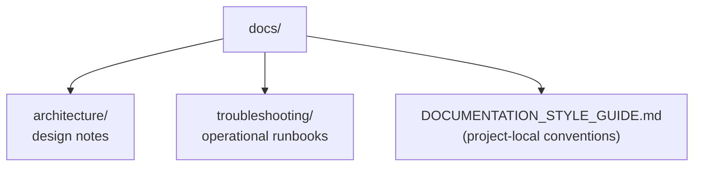

# Zombies Simulator V3 — Documentation

This directory holds the project's internal documentation. The
[root `README.md`](../README.md) is the end-user quickstart; everything here
is for contributors and maintainers.

## Contents

### Architecture

- [`architecture/toolchain.md`](architecture/toolchain.md) — the TypeScript 7
  (native) / esbuild-loader migration: why `ts-loader` could not be used, what
  was chosen instead, and the strict-mode fixes that shipped with it.

> A `system-overview.md` covering the simulation pipeline (entity lifecycle →
> behaviour composition → spatial hashing → GPU-instanced rendering → paintable
> flow field) is planned but not yet written.

### Troubleshooting

- [`troubleshooting/common-issues.md`](troubleshooting/common-issues.md) —
  blank/black canvas, WebGL context loss, shader-compile failures,
  `yarn start` issues, and the full dev command reference.

### Conventions

- [`DOCUMENTATION_STYLE_GUIDE.md`](DOCUMENTATION_STYLE_GUIDE.md) — the
  project-local documentation style guide. Points at the global guide for the
  generic baseline.

## External references

- [Keep a Changelog](https://keepachangelog.com/en/1.1.0/) — the format used
  by the root [`CHANGELOG.md`](../CHANGELOG.md).
- [Semantic Versioning](https://semver.org/spec/v2.0.0.html) — the project's
  versioning policy (see `CHANGELOG.md` for the milestone-policy exception).
- [twgl.js docs](https://twgljs.org/) — the WebGL2 helper library used for
  program/buffer management.
