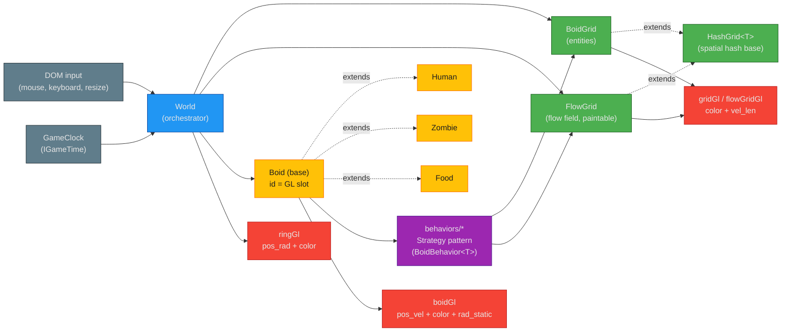
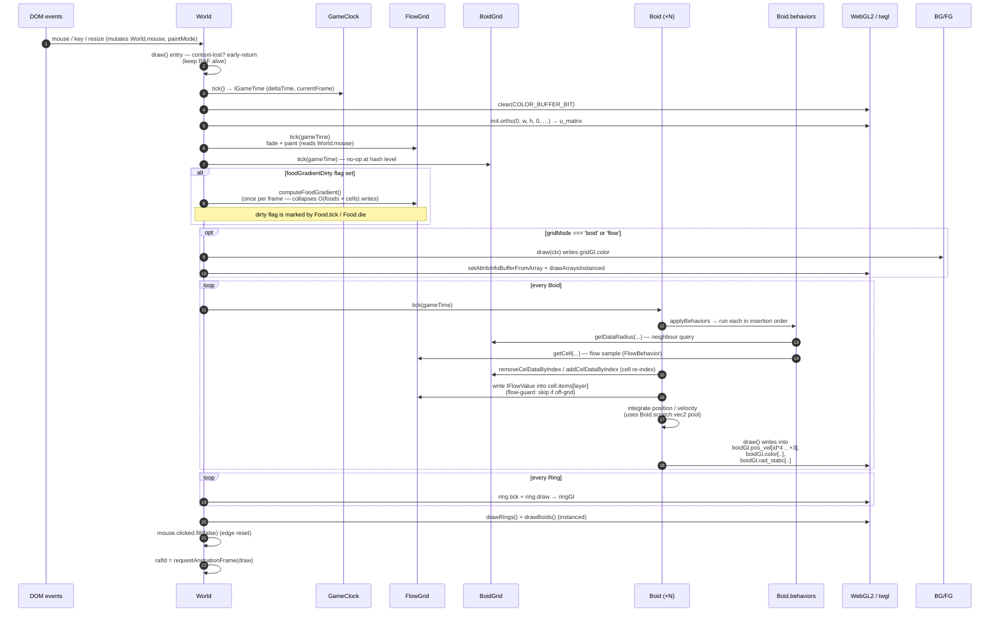

# System Overview

A walkthrough of the par-zombie3 simulation pipeline: how `World` orchestrates
the entity lifecycle, the spatial grids that accelerate neighbour queries, the
Strategy-pattern behaviour composition that drives each boid, and the
GPU-instanced WebGL2 render passes that draw a frame. Read this alongside
[`toolchain.md`](toolchain.md) (build/type-check) and
[`../troubleshooting/common-issues.md`](../troubleshooting/common-issues.md)
(runtime failures).

## Contents

1. [Component diagram](#component-diagram)
2. [Frame-loop sequence](#frame-loop-sequence)
3. [`src/math` conventions](#srcmath-conventions)
4. [Per-shader attribute packing](#per-shader-attribute-packing)
5. [Planned refactoring (ARC-002)](#planned-refactoring-arc-002)

## Component diagram

`World` is currently a single orchestrator object that owns every collaborator
(see [Planned refactoring](#planned-refactoring-arc-002) for why that is
deferred). The arrows below show data flow during one frame: input and the
game clock feed `World.draw`; the grids are queried by the entities' behaviour
strategies; the entities write into typed-array-backed GL buffers; the render
passes consume those buffers via `twgl.js`.



Reading the diagram:

- **`World`** owns the `BoidGrid`, the `FlowGrid`, the `boids`/`humans`/`zombies`/`food` sets, the `boidGl`/`gridGl`/`flowGridGl`/`ringGl` buffer bundles, and the requestAnimationFrame loop. It is constructed exactly once from [`src/index.ts`](../../src/index.ts).
- **`HashGrid<T>`** is the spatial-hash base. `BoidGrid` and `FlowGrid` both extend it; `BoidGrid` colours cells by entity density, `FlowGrid` overrides item storage so each layer writes to its own index slot.
- **Entities** (`Boid`, `Human`, `Zombie`, `Food`) all extend `Boid`. `Food` is static and lives on the food layer; `Human` and `Zombie` add species-specific behaviour sets.
- **Behaviours** (`src/behaviors/*`) follow the Strategy pattern: each `Boid` holds a `Map<string, BoidBehavior<Boid>>` and runs them in insertion order every tick.
- **Render passes** are plain typed arrays on `World` (`boidGl.pos_vel`, `gridGl.color`, `ringGl.pos_rad`, etc.). Each entity's `draw()` writes into its `id`-indexed slot; `World.draw*()` calls `twgl.setAttribInfoBufferFromArray` and issues a single `drawArraysInstanced` per program.

## Frame-loop sequence

One frame is `World.draw()` (in [`src/World.ts`](../../src/World.ts)). The
sequence below shows the order: input is read from DOM event handlers that
mutated `World.mouse` / `World.paintMode`; the game clock advances; grids
and boids tick; GL buffers are written; the instanced draws fire.



Anchor points worth knowing:

- **`foodGradientDirty`** is the once-per-frame recompute gate for the food-seeking flow field. `Food.tick` (on growth/shrink thresholds) and `Food.die` call `World.markFoodGradientDirty()`. `World.draw` checks the flag *before* any boid reads the flow field, so all boids see a consistent gradient for the frame.
- **Context-loss restore** runs on the *first* frame after `webglcontextrestored` fires (the `needsGlRestore` flag). `restoreGlContext()` re-runs `initBoidGl`, `initRingGl`, `initGridGl` — the simulation state (boids, grids, cache) is plain JS and survives the GPU reset; only programs and buffers were lost. While `contextLost` is true, `draw()` cancels its RAF and just re-arms one so the loop resumes on restore.
- **Per-Boid scratch vec2 pool** (`Boid.scratch.{t, fp1, fp2, dTemp}`) is allocated once per boid and reused via the `dest` out-parameter on every `vec2` operation in the hot loop. The aliasing rule: a named slot is the `dest` of at most one call per expression — never two writes to the same slot in sequence from one statement. See [src/math conventions](#srcmath-conventions).
- **Cell re-index** happens at the end of `Boid.tick`: if the boid's new position falls in a different cell, `removeCelDataByIndex` + `addCelDataByIndex` move it. `Boid.id` is also the entity's slot in every per-boid typed array, so the GL buffers do not need to be rebuilt when entities die or convert.
- **`Boid.tick` flow-guard**: a boid clamped to the world edge can legitimately be off the flow grid (`FlowGrid.getCell` returns `undefined` outside the field). `Boid.tick` checks for that and skips the flow contribution for the frame rather than throwing — the rest of `tick` (position clamp, grid re-insert) has already run.

## `src/math` conventions

The project's math library is intentionally small: [`vec2`](../../src/math/vec2.ts),
[`vec4`](../../src/math/vec4.ts), and a few helpers in
[`scalar.ts`](../../src/math/scalar.ts) and
[`constants.ts`](../../src/math/constants.ts). The
mat2/mat3/mat4/vec3/quat modules the audit found as dead code were deleted
(QA-005) — orthographic projection is the only matrix operation the renderer
needs, and it goes through twgl.js's `m4`:

```ts
m4.ortho(0, ctx.canvas.width, ctx.canvas.height, 0, -1, 1, this.u_matrix);
```

### The `dest?` mutate-or-return convention

Every `vec2`/`vec4` arithmetic method takes an optional trailing `dest`
parameter. The rule is uniform:

- **If `dest` is provided**, the result is written into `dest` and `dest` is returned.
- **If `dest` is omitted**, the operation mutates `this` in place and returns `this`.

```ts
const a = new vec2(1, 0);
const b = new vec2(0, 1);
const out = new vec2();

a.add(b);          // mutates a, returns a
a.add(b, out);     // writes a+b into out, leaves a untouched, returns out
```

The methods that follow this convention: `add`, `subtract`, `multiply`,
`divide`, `scale`, `normalize`, `clamp`, `copy`, `negate`, `random`,
`rotateLeft`, `rotateRight`, `directionTo`. The static helpers
(`vec2.sum`, `vec2.difference`, `vec2.product`, `vec2.quotient`, `vec2.mix`,
`vec2.direction`) take `dest?` as well, but allocate a fresh `vec2` when it is
omitted (they have no `this` to mutate).

**Why this matters for the hot loop:** every `Boid` owns a `scratch`
pool of four `vec2`s (`t`, `fp1`, `fp2`, `dTemp`) allocated once at
construction. Behaviours and `Boid.tick` pass these as `dest` so the
per-frame allocation count stays at zero. The rule that keeps this safe is
documented at the pool declaration in [`src/boids/Boid.ts`](../../src/boids/Boid.ts):
*each named slot is passed as `dest` to at most one call per expression*.

### Return-on-singular behaviour

The arithmetic methods do not throw on degenerate input:

- `vec2.normalize` with `length === 0` writes `(0, 0)` into `dest` (or `this`)
  and returns it. With `length === 1`, it short-circuits and returns `this`
  untouched.
- `vec2.direction(a, b, dest?)` with coincident points writes `(0, 0)`.
- `vec2.scale`, `add`, `subtract`, etc. propagate `NaN` if any component is
  `NaN`; callers that cannot tolerate that should clamp inputs first.

The `epsilon` constant (1e-5, in [`constants.ts`](../../src/math/constants.ts))
is the canonical threshold for "treat as zero" — used by the simulation to
gate divide-by-length operations and to drive shader-side `if (x < EPSILON)`
guards.

### Frozen static constants

`vec2.zero`, `vec2.one`, `vec2.up`, `vec2.down`, `vec2.left`, and
`vec2.right` are `Object.freeze`'d at class-init time. The declared type is
still `vec2` (the cast silences the freeze-related type narrowing) so
existing reads type-check, but any mutation (`vec2.zero.x = 5` or
`vec2.zero.add(v)` without a `dest`) throws in strict mode — ESM is always
strict, so the throw is unconditional at runtime. The freeze was added by
audit QA-003 after a shared-mutable-static hazard.

## Per-shader attribute packing

Three WebGL2 programs do all the drawing. Each is built once in an
`World.init*Gl` method (re-run on context restore — see
[frame-loop sequence](#frame-loop-sequence)). The instances are drawn with
`drawArraysInstanced(TRIANGLES, 0, 6, N)`: two triangles from
`DefaultBufferValues.vert_pos`, one invocation per entity.

### Boid program (`boid.vs` / `boid.fs`)

Source: [`src/shaders/boid.vs`](../../src/shaders/boid.vs),
[`src/shaders/boid.fs`](../../src/shaders/boid.fs). Buffer bundle:
`World.boidGl` (`IBoidGl`).

| Attribute     | Type   | Divisor | Packing                                                    |
|---------------|--------|---------|------------------------------------------------------------|
| `vert_pos`    | `vec2` | 0       | Shared quad (6 verts, `[-0.5,-0.5] … [0.5,0.5]`).          |
| `texcoord`    | `vec2` | 0       | Shared UVs (unused in shader, kept for parity).            |
| `pos_vel`     | `vec4` | 1       | `.xy` = world position, `.zw` = velocity vector (px/s).    |
| `color`       | `vec4` | 1       | RGBA tint.                                                 |
| `rad_static`  | `vec4` | 1       | `.x` = radius, `.y` = static flag (1 = static), `.zw` free.|

Per-instance data is written in `Boid.draw`, indexed at `this.id * 4`:

```ts
buffers.pos_vel[i]     = p.x;  buffers.pos_vel[i + 1] = p.y;
buffers.pos_vel[i + 2] = v.x;  buffers.pos_vel[i + 3] = v.y;
buffers.color[i]       = this.color.r;  // …g, …b, …a
buffers.rad_static[i]  = this.alive ? this.r : 0;
buffers.rad_static[i+1] = this.static ? 1 : 0;
```

**Cull rule** (dead boids): when a boid dies, `Boid.draw` writes
`rad_static.x = 0`. The vertex shader emits a degenerate position outside the
clip volume for any instance whose `rad_static.x < EPSILON`, so the GPU
produces no rasterized fragments for dead boids without needing a buffer
compaction. `boid.fs` repeats the same test (`v_radius < EPSILON` →
`discard`) as a defensive guard.

**Heading stripe** (`boid.fs`): every live, non-static boid carries a thin
red stripe along its *leading* half — the half of the disc that points in the
direction of motion. The vertex shader computes `v_angle` as the normalized
velocity (`pos_vel.zw / length`), guarded against divide-by-zero (QA-020:
stationary boids emit `vec2(0.0)`). The fragment shader then checks
`dot(v_angle, dir) < 0.0` where `dir` is the fragment's offset from the
boid's center — negative means the fragment is on the side `v_angle` points
*toward*. Within that leading half, the stripe is the narrow band where the
perpendicular component (`abs(dot(vec2(-v_angle.y, v_angle.x), dir))`) is
small. See the leading comment block at the top of
[`src/shaders/boid.fs`](../../src/shaders/boid.fs) for the exact rule.

**GLSL guards** added by audit QA-020:

- `boid.vs` divides `pos_vel.zw` by its length only when `length > EPSILON`,
  otherwise emits `vec2(0.0)` for `v_angle`. Without the guard, stationary
  boids propagated `NaN` into the heading-stripe test.
- `grid.vs` (see below) replaced `length(vel_len.z)` (length-of-a-scalar,
  effectively `abs(z)`) with `vel_len.z` directly, and replaced
  `normalize(vel_len.xy)` with a branch on its length so empty flow cells no
  longer produce `NaN` angles.

### Grid program (`grid.vs` / `grid.fs`)

Source: [`src/shaders/grid.vs`](../../src/shaders/grid.vs),
[`src/shaders/grid.fs`](../../src/shaders/grid.fs). Shared by `World.gridGl`
(`BoidGrid` debug draw) and `World.flowGridGl` (`FlowGrid` debug draw);
`gridMode` uniform selects the fragment branch. Buffer bundles: `IGridGl`
and the extended `IFlowGridGl`.

| Attribute   | Type   | Divisor | Packing                                                                                  |
|-------------|--------|---------|------------------------------------------------------------------------------------------|
| `vert_pos`  | `vec2` | 0       | Shared quad.                                                                             |
| `texcoord`  | `vec2` | 0       | Shared UVs.                                                                              |
| `color`     | `vec4` | 1       | Per-cell tint (density for `BoidGrid`, type colour for `FlowGrid`).                      |
| `vel_len`   | `vec4` | 1       | `.xy` = flow direction, `.z` = flow strength, `.w` = solid flag. (FlowGrid path only.)   |

`gl_InstanceID` is used to reconstruct the cell's world center on the GPU
(`grid.vs`), so no per-cell position attribute is needed.

### Ring program (`ring.vs` / `ring.fs`)

Source: [`src/shaders/ring.vs`](../../src/shaders/ring.vs),
[`src/shaders/ring.fs`](../../src/shaders/ring.fs). Buffer bundle:
`World.ringGl` (`IRingGl`).

| Attribute  | Type   | Divisor | Packing                                                |
|------------|--------|---------|--------------------------------------------------------|
| `vert_pos` | `vec2` | 0       | Shared quad.                                           |
| `texcoord` | `vec2` | 0       | Shared UVs.                                            |
| `pos_rad`  | `vec4` | 1       | `.xy` = world position, `.z` = radius, `.w` = duration.|
| `color`    | `vec4` | 1       | `.xyz` = tint, `.w` = thickness.                       |

Rings with `pos_rad.w < EPSILON` are degenerate-positioned out, mirroring the
boid dead-slot rule. `Ring.draw` always writes `pos_rad.w = duration`, so a
ring that has finished expanding is culled by the same mechanism.

## Planned refactoring (ARC-002)

This document describes the **current** structure, in which `World` is a
thin orchestrator that delegates per-frame work to four collaborators
(see [Collaborator split (ARC-002, done)](#collaborator-split-arc-002-done)
below). The audit opened **ARC-002** to split the original `World` God
object along its existing seams into `Renderer` (GL programs/buffers +
draw), `Input`/`MouseController`, `BoidFactory`/`Spawner`, and
`FlowFieldGenerator`. That split has shipped; this section is retained as
a record of what moved where and what stayed.

When the split landed, the Mermaid diagrams above received three updates:

- The `World` node split into `Renderer`, `Input`, `Spawner`,
  `FlowFieldGenerator`, and a thin `World` orchestrator. (The diagram
  above still names `World` as the hub for readability — the four
  collaborators are listed in [Collaborator split](#collaborator-split-arc-002-done).)
- The `init*Gl` / `draw*` methods moved to `Renderer` (and absorb ARC-011:
  the per-instance buffer writes that used to live on `Boid.draw` /
  `Ring.draw` are now `Renderer.writeBoidBuffers` / `writeRingBuffers`);
  the `mouse` state and the DOM listeners moved to `Input`;
  `initBoids` / `randomizeBoids` moved to `Spawner`; `genField` /
  `computeFoodGradient` (with the QA-022 dirty flag) moved to
  `FlowFieldGenerator`.
- Entities (`Boid`, `Ring`) no longer touch WebGL — they expose PURE STATE
  and the Renderer renders. The `IDrawable` interface was removed.
  (The grids still take a buffer bundle as a `draw(buffers)` param —
  their cell-colour/flow-write logic stays with the grid, the GL upload
  stays with the Renderer.)

## Collaborator split (ARC-002, done)

`World` (in [`src/World.ts`](../../src/World.ts)) owns the grids, the entity
collections, the layer bitmask map, the dimensions, the agent-operability
options, the tick/draw loop, `resize`, `dispose`, and the context-loss
listener wiring. It constructs four collaborators and delegates:

| Collaborator | File | Owns | Receives |
|---|---|---|---|
| `Renderer` | [`src/Renderer.ts`](../../src/Renderer.ts) | All WebGL — the four GL program/buffer bundles (`boidGl`/`gridGl`/`flowGridGl`/`ringGl`), the `init*Gl` methods, the draw methods, uniform setup, the context-loss restore, AND (ARC-011) the per-instance buffer writes for boids and rings. | `ctx`, `world`. |
| `Input` | [`src/Input.ts`](../../src/Input.ts) | Every keyboard/mouse/contextmenu/help-toggle listener and the `mouse` state. Sole writer of `world.paintMode` / `paintSize` / `gridMode`. | `world`, `canvas`, `helpEl`, `helpToggleEl`. |
| `Spawner` | [`src/Spawner.ts`](../../src/Spawner.ts) | Entity factory (`initBoids` / `randomizeBoids`) and the per-World boid-id allocator (ARC-009). | `world`. |
| `FlowFieldGenerator` | [`src/FlowFieldGenerator.ts`](../../src/FlowFieldGenerator.ts) | Procedural noise field (`genField` / `getFlowFieldValue`) and the food-gradient solver (`computeFoodGradient`) with the QA-022 dirty flag. | `world`. |

Entities, grids, and the collaborators reach through `world.X` only for
**shared state** (`mouse`, `paintMode`, the entity arrays, `layerByName`,
dimensions). No collaborator reaches through `world` for **its core job**
— that's what makes the split a real decoupling rather than a rename.
The remaining `World ↔ grids ↔ boids` import cycle (entities still
`import { World } from '../World'` for typing) is ARC-008 territory.
